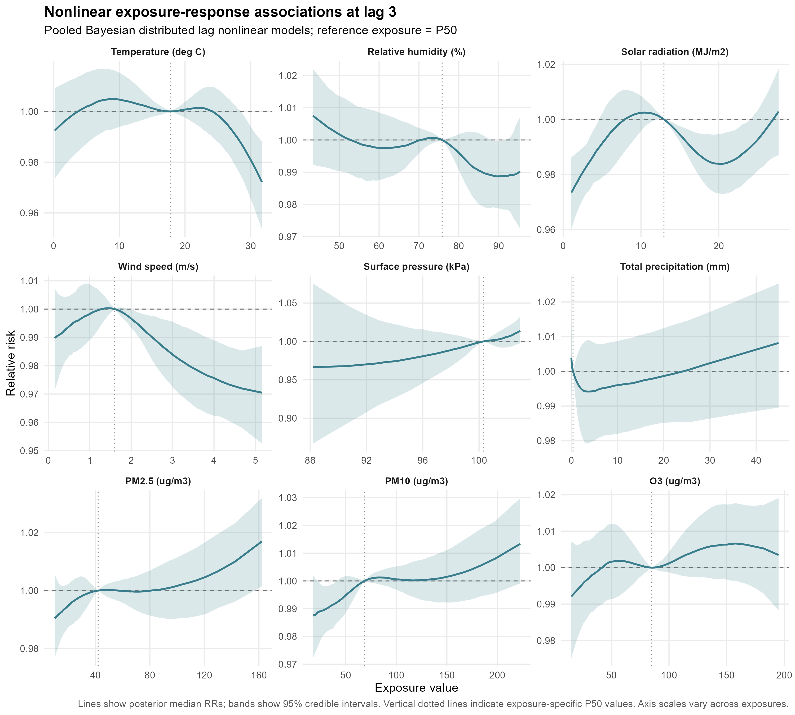
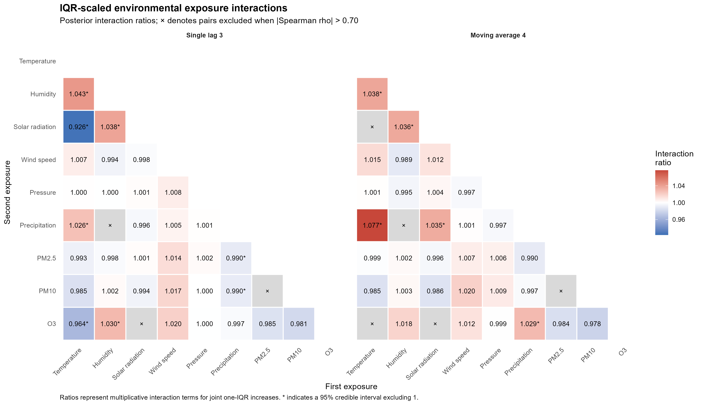
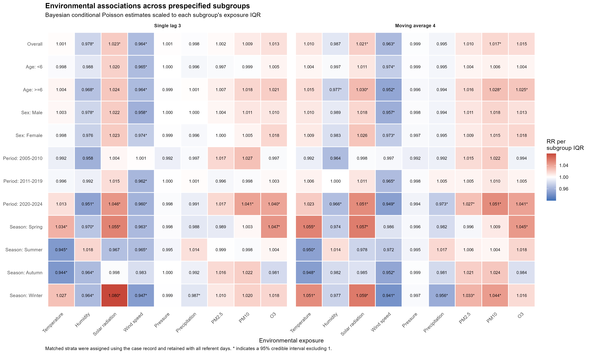
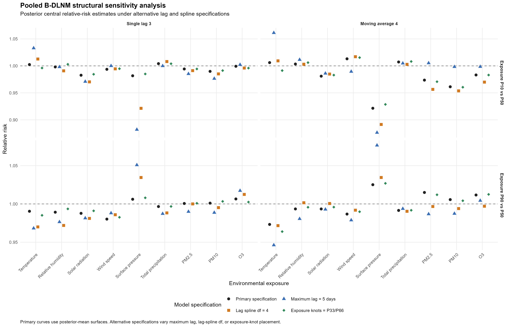

# Bayesian Scarlet Fever Analysis

Privacy-safe code and aggregate results from an MSc Applied Statistics project
examining short-term environmental associations with scarlet fever in Hubei
and Hunan, Central China.

The project combines a time-stratified case-crossover design with Bayesian
conditional Poisson regression, distributed lag nonlinear models, exploratory
spatially varying effects, interaction analysis, subgroup analysis, and model
sensitivity checks.

## Study overview

The restricted analytical dataset contains:

- 29,147 reported scarlet fever cases;
- 128,557 matched case and referent-day observations;
- records spanning 2004-2024;
- nine environmental exposures:
  temperature, relative humidity, solar radiation, wind speed, surface
  pressure, precipitation, PM2.5, PM10, and O3;
- single-day exposure histories from lag 0 through lag 10.

Individual-level health, date, address, coordinate, and matched-set data are
not distributed. The repository contains code, an analytical data dictionary,
and selected aggregate outputs only.

## Analytical workflow

1. Validate the restricted analytical-data schema.
2. Reconstruct moving-average exposures from lag 0 through lag k.
3. Produce aggregate descriptive summaries.
4. Fit 189 Bayesian single-exposure conditional Poisson models.
5. Fit 18 pooled Bayesian distributed lag nonlinear models (B-DLNMs).
6. Prepare county adjacency structures and exploratory spatial B-DLNMs.
7. Screen environmental exposure pairs and fit 64 interaction models.
8. Fit 216 models across 12 prespecified population subgroups.
9. Evaluate PC-prior and pooled B-DLNM structural sensitivity.

All Bayesian models use INLA. Long model batches use checkpoint files and can
resume after interruption.

## Selected aggregate results

### Pooled nonlinear exposure-response estimates

The primary pooled B-DLNMs use natural-spline exposure-response functions,
a three-degree-of-freedom lag spline, and exposure knots at P25, P50, and P75.
Curves are referenced to the median exposure.



### Environmental exposure interactions

Pairs with an absolute Spearman correlation above 0.70 were excluded before
interaction modelling. The remaining models use median-centred, IQR-scaled
exposures.



### Prespecified subgroup analysis

Subgroups are assigned using the case record in each matched stratum. All
referent days belonging to an eligible stratum are retained so that the
matched design is preserved.



### Structural sensitivity analysis

The primary pooled B-DLNM is compared with models using a five-day maximum
lag, four lag-spline degrees of freedom, or exposure knots at P33 and P66.
The comparison shows where posterior central estimates are stable and where
they remain sensitive to model structure.



Additional aggregate figures and result tables are documented in [`figures/README.md`](figures/README.md) and [`results/README.md`](results/README.md).

## Repository structure

```
R/
  01_data_contract.R
  02_prepare_analysis_data.R
  03_descriptive_analysis.R
  04_bayesian_conditional_poisson.R
  05_pooled_bdlnm.R
  06_spatial_bdlnm.R
  07_interaction_analysis.R
  08_subgroup_analysis.R
  09_sensitivity_analysis.R
  10_repository_checks.R
config/
  config.example.R
data/
  data_dictionary.csv
figures/
  selected aggregate figures
results/
  selected aggregate model outputs
```

## Environment setup

The recorded environment uses R 4.4.1. Package versions and the official INLA repository are recorded in `renv.lock`.

```
install.packages("renv")
renv::restore()
```

Copy the example configuration and replace the placeholder paths with authorized local data and boundary files:

```
file.copy(
  "config/config.example.R",
  "config/config.R"
)
```

`config/config.R` is excluded from version control.

## Running the analysis

Each script can be sourced independently after its prerequisites have been completed. Examples:

```
source("R/03_descriptive_analysis.R")
run_descriptive_analysis()

source("R/04_bayesian_conditional_poisson.R")
run_all_conditional_poisson_models()

source("R/05_pooled_bdlnm.R")
run_all_pooled_bdlnm_models()

source("R/07_interaction_analysis.R")
run_all_interaction_models()

source("R/08_subgroup_analysis.R")
run_all_subgroup_models()
run_subgroup_iqr_scaling()

source("R/09_sensitivity_analysis.R")
run_all_linear_prior_sensitivity_models()
run_all_bdlnm_sensitivity_models()
```

Full spatial B-DLNMs are not part of the default desktop workflow. The original spatial analysis used a 128 GB cloud environment. See [`COMPUTE_REQUIREMENTS.md`](COMPUTE_REQUIREMENTS.md) for details.

## Public repository validation

The public scripts, dependency metadata, aggregate outputs, figure files, and
tracked-file privacy rules can be checked without access to restricted data:

```r
source("R/10_repository_checks.R")
```

The check verifies expected files, parses all R scripts, validates model and
result counts, checks the dependency lockfile, and confirms that restricted
data and fitted model objects are not tracked.

## Data privacy and availability

The public repository cannot reproduce the analysis without authorized access to the restricted analytical dataset. It instead provides:

- the complete expected variable schema;
- data validation and transformation code;
- model definitions and checkpointed workflows;
- aggregate result tables and figures;
- explicit documentation of excluded sensitive material.

See [`DATA_AVAILABILITY.md`](DATA_AVAILABILITY.md) for the full data-access and privacy statement.

## Technical scope

This project demonstrates:

- Bayesian hierarchical modelling with INLA;
- matched case-crossover and conditional Poisson methods;
- distributed lag nonlinear modelling;
- spatial adjacency construction with `sf` and `spdep`;
- posterior simulation and uncertainty propagation;
- resumable model pipelines;
- privacy-aware public research repositories;
- reproducible dependency management with `renv`.

## Licence

Code is released under the [MIT License](LICENSE). Data-provider terms and restrictions remain separate and are not covered by the software licence.
